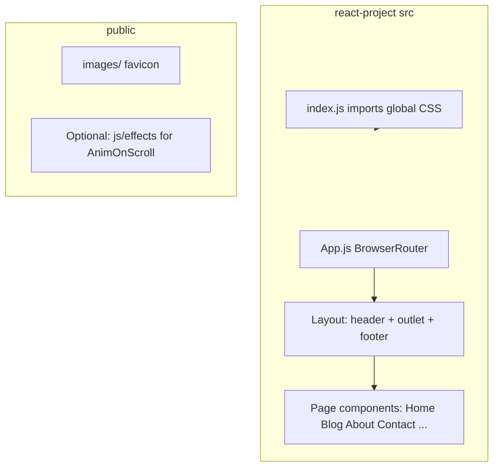

# Avana vanilla → `react-project` (CRA, 2019-style)

## Context

- **Source**: [2019/portfolio/avana/vanilla](website-themes/2019/portfolio/avana/vanilla) — six pages: `index.html` (Work/home), `blog.html`, `blog-details.html`, `about.html`, `contact.html`, `works-details.html`, plus shared header/footer and CSS/JS.
- **Target**: New folder [2019/portfolio/avana/react-project](website-themes/2019/portfolio/avana/react-project) — **does not exist yet**; will be created.
- **Existing overlap**: [2019/portfolio/avana/react/js](website-themes/2019/portfolio/avana/react/js) already has CRA-style `package.json` (React `^16.8.6`, `react-scripts` `3.0.1`) and copied styles/fonts. Treat **vanilla** as the content source of truth; use `react/js` only as a reference for what was already copied (e.g. [Logo.js](website-themes/2019/portfolio/avana/react/js/src/components/Logo.js)).

## 2019 stack (assumptions)

| Piece | Choice | Rationale |
|--------|--------|-----------|
| Tooling | **Create React App** (`react-scripts` **3.x**) | Matches “CRA + 2019” explicitly. |
| React | **16.8.x** | Hooks available; matches existing [react/js/package.json](website-themes/2019/portfolio/avana/react/js/package.json). |
| Entry | `ReactDOM.render` | CRA 3 default; not React 18 `createRoot`. |
| Routing | **`react-router-dom` v5** (`BrowserRouter`, `Route`, `Switch`) | Typical for 2019; no v6 `Routes`/`element` API. |
| Components | **Function components + hooks** | “React 2019 standard” after hooks shipped in 16.8. |
| Lint | `eslintConfig.extends: react-app` | CRA default. |

## Route map (replace `.html` with client routes)

| Vanilla file | Suggested path | Notes |
|--------------|----------------|--------|
| `index.html` | `/` | Work grid + `AnimOnScroll` on `#grid` ([nav.js](website-themes/2019/portfolio/avana/vanilla/js/nav.js)). |
| `blog.html` | `/blog` | |
| `blog-details.html` | `/blog/:slug` or `/blog/details` | Use a param if multiple posts; single static page can use fixed route. |
| `about.html` | `/about` | |
| `contact.html` | `/contact` | Map `#surabaya`, form `action` to PHP ([contact.html](website-themes/2019/portfolio/avana/vanilla/contact.html)). |
| `works-details.html` | `/work` or `/work/:id` | Same pattern as blog details. |

**Active nav**: Pass current route (or `NavLink`) into header/footer so `nav-active` matches vanilla per page.

## Project layout (high level)

- **`src/components/`**: `Header`, `Footer`, `Logo` (reuse pattern from existing `Logo.js`), optional `ScrollToTop` for router.
- **`src/pages/`**: One component per route; extract repeated Bootstrap markup from vanilla HTML verbatim into JSX (`className`, `role`, semantic tags preserved).
- **`src/App.js`**: Router + layout wrapper only (thin).

## Static assets migration

1. **Images & favicon**: Copy [vanilla/images](website-themes/2019/portfolio/avana/vanilla/images) (and favicon) into **`public/`** so URLs stay stable as **`/images/...`** (matches existing theme paths and avoids rebasing hundreds of paths). Alternatively use `process.env.PUBLIC_URL` where needed for subdirectory deploy.
2. **Fonts**: Copy [vanilla/fonts](website-themes/2019/portfolio/avana/vanilla/fonts) to `public/fonts` (or keep under `src` if you switch CSS `url()` — **public is simpler** for large icon fonts).
3. **CSS**: Copy [vanilla/css](website-themes/2019/portfolio/avana/vanilla/css) tree into e.g. **`src/assets/styles/`** and **import once** in [src/index.js](website-themes/2019/portfolio/avana/react/js/src/index.js) (or a single `theme.css` that `@import`s in the same order as vanilla `index.html` head: `style`, bootstrap, responsive, font-awesome, effects). **Fix broken links**: several vanilla pages reference `css/fonts.css` and sometimes `css/set2.css` at the wrong path — the repo has [css/effects/set2.css](website-themes/2019/portfolio/avana/vanilla/css/effects/set2.css); **`fonts.css` is missing** — either add the missing file from the original theme bundle or remove those `<link>`s in the React app’s consolidated imports.

## JavaScript / behavior (important design choice)

Vanilla relies on **jQuery + plugins** ([nav.js](website-themes/2019/portfolio/avana/vanilla/js/nav.js): `menumaker`, `AnimOnScroll` on `#grid`; [jquery.contact.js](website-themes/2019/portfolio/avana/vanilla/js/jquery.contact.js); [custom.js](website-themes/2019/portfolio/avana/vanilla/js/custom.js) for subscribe; [maps.js](website-themes/2019/portfolio/avana/vanilla/js/maps.js) for Google Maps).

**Recommended split for a 2019-style React codebase:**

1. **Navigation (mobile menu)** — Reimplement with **React state** (toggle classes `menu-opened` / `open` / slide behavior) and the same DOM/class hooks as `.navy`, so **jQuery `menumaker` is not required**. This aligns with common 2019 guidance: avoid new jQuery in React apps.
2. **Home scroll animation (`AnimOnScroll`, Masonry-related deps)** — Two options:
   - **A (parity-first)**: Copy `js/effects/*` + `masonry`, `imagesloaded`, `classie`, `AnimOnScroll`, `modernizr` into `public/js/`, load **only on Home** via `useEffect`: after mount, ensure **a single** `#grid` container (vanilla HTML incorrectly duplicates `id="grid"` twice; React should use **one** list or `ref` + unique id). Initialize `AnimOnScroll` like [nav.js lines 64–68](website-themes/2019/portfolio/avana/vanilla/js/nav.js).
   - **B (React-only)**: Replace with a small Intersection Observer hook or CSS animations — more work, different timing; use only if you drop legacy scripts entirely.
3. **Contact form** — Port [jquery.contact.js](website-themes/2019/portfolio/avana/vanilla/js/jquery.contact.js) logic to **`fetch`**/`axios` in React: `POST` to the same `action` URL. Use `REACT_APP_CONTACT_ENDPOINT` (e.g. absolute URL to your PHP host) because CRA dev server is not PHP. **Note**: The script references `#submit` but the vanilla form uses a submit input **without** `id="submit"` — align markup and script so disable/loader behavior works.
4. **Google Maps** — Load Maps JavaScript API **conditionally** on Contact mount (dynamic `<script>` or a tiny loader). Move API key to **`REACT_APP_GOOGLE_MAPS_API_KEY`**. Port [maps.js](website-themes/2019/portfolio/avana/vanilla/js/maps.js) logic into a `useEffect` that runs after `google` is available and `#surabaya` exists (use `ref` instead of `getElementById` if preferred). Remove deprecated `sensor=false` query param when updating the script URL.
5. **Subscribe form** (`custom.js`) — Only if that markup exists on a page you port; implement with React `onSubmit` + `fetch`, same as contact.

## CRA bootstrap steps (when implementing)

1. Create the app folder with CRA 3 / template matching the repo (e.g. `npx create-react-app@3 react-project` **inside** `2019/portfolio/avana/`, or align versions manually to match [react/js/package.json](website-themes/2019/portfolio/avana/react/js/package.json)).
2. Add **`react-router-dom@5`** (e.g. `^5.3.x`).
3. Replace default `App` content with router + layout; add pages incrementally until all six views match vanilla.
4. Copy assets as above; wire global CSS imports; verify responsive + Font Awesome icons.
5. Add **`.env.example`** documenting `REACT_APP_GOOGLE_MAPS_API_KEY` and `REACT_APP_CONTACT_ENDPOINT` (or document PHP proxy for local dev).

## Testing and quality bar

- Smoke test each route in dev and production build (`npm run build` + static server).
- Optional: keep CRA’s `App.test.js` as a minimal render test; add router `MemoryRouter` if testing pages.

## Relationship to `react/js`

- **`react-project`** is the new canonical CRA app per your request.
- **`react/js`** can remain as-is or be deprecated in favor of `react-project` to avoid two diverging React trees — decide in repo maintenance (no code change required for this plan).
